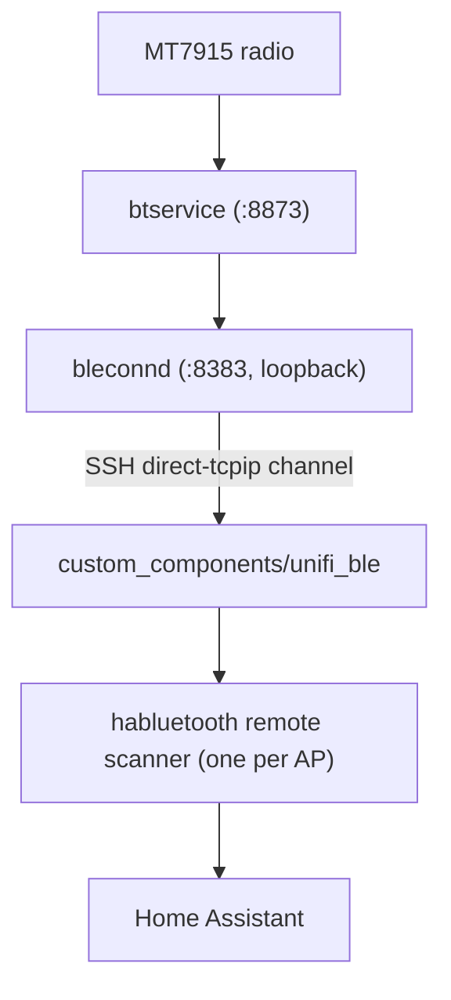

# UniFi AP BLE Proxy for Home Assistant

Turn the Bluetooth Low Energy radios built into UniFi access points into remote
Bluetooth scanners for Home Assistant — the same role an ESPHome Bluetooth proxy
plays, but using hardware you already have. Each adopted AP becomes a coverage
point; Home Assistant aggregates them and picks the closest one per device by RSSI.

## How it works

UniFi APs run a local BLE service, `bleconnd`, that exposes a line-oriented JSON
API on `127.0.0.1:8383` (loopback only). It already serves multiple clients
(UniFi's own `blebrd`/`blebr2d` bridges), so this integration attaches as an
additional client, starts a scan, and forwards every advertisement to Home
Assistant. UniFi Protect keeps using its own path (the TLS bridge on `:8381`) and
is not disturbed.



For a full description of the AP BLE stack and the `bleconnd` wire protocol, see
[docs/unifi-ble-and-bleconnd.md](docs/unifi-ble-and-bleconnd.md).

Because `:8383` is loopback-only, the integration reaches it over SSH. It
generates its own SSH keypair, shows you the public key at setup, and opens the
tunnel itself using [`asyncssh`](https://asyncssh.readthedocs.io/) — no external
`autossh` or manually managed port forwards. If Home Assistant cannot reach the
AP directly, it can hop through your UDM/gateway as an SSH jump host.

## Requirements

- Home Assistant 2026.7+ (validated against `habluetooth` 6.26.4; the integration
  depends on the `bluetooth_adapters` integration).
- UniFi APs with a BLE radio, adopted by a controller. SSH key access to the APs is
  set via **Device SSH Authentication**; if you route through the gateway as a jump
  host, its console SSH key is added manually (see Installation).
- Network reachability from Home Assistant to each AP's SSH port, directly or via
  a jump host (e.g. the UDM/gateway).

## Installation

1. Copy [`custom_components/unifi_ble/`](custom_components/unifi_ble/) into your Home Assistant `config/custom_components/`
   directory and restart Home Assistant.
2. Go to **Settings → Devices & Services → Add Integration → "UniFi AP BLE Proxy"**.
   The first screen shows a generated **public SSH key** (a read-only field with a
   copy icon).
3. Provision that key in UniFi. There are two separate places:
   - **APs:** **UniFi Devices → Device Updates and Settings → Device SSH
     Authentication** — enable it and add the key. It's pushed to your adopted APs.
   - **Gateway (only if you'll use it as an SSH jump host):** **Settings → Control
     Plane → Console** only lets you set an SSH *password*, so SSH into the console
     once with that password and append the key to `~/.ssh/authorized_keys`
     manually — there's no key-upload UI for the console itself.
4. Back in Home Assistant, enter each AP's connection details (set the jump host to
   your gateway if HA can't reach the AP directly). Add the integration once per AP.

## Configuration

Per AP:

| Field         | Meaning                                                        | Default         |
|---------------|----------------------------------------------------------------|-----------------|
| Host          | AP IP/hostname                                                 | —               |
| Username      | SSH username (UniFi device SSH user)                           | `admin`         |
| Port          | `bleconnd` port on the AP                                      | `8383`          |
| Jump host     | UDM/gateway to hop through, if the AP isn't directly reachable | *(blank)*       |
| Jump username | SSH username on the jump host                                  | same as AP user |

Each AP is identified by its BLE MAC (discovered during setup) so re-adding is idempotent.

## Repository layout

```
custom_components/unifi_ble/   The Home Assistant integration
  bleconn.py    async bleconnd client + advertisement parser (transport-agnostic)
  ssh.py        SSH tunnel transport + shared Ed25519 keypair management
  scanner.py    UnifiBleScanner (habluetooth BaseHaRemoteScanner)
  __init__.py   entry setup: one scanner per AP, register + background task
  config_flow.py, const.py, manifest.json, strings.json, translations/
tools/
  py            run the project venv's Python with the snap sandbox env stripped
  scan_ha.py    exercise the async client against forwarded ports; print adverts
  bleconn.py    pcap decoder + one-shot probe for the bleconnd protocol
  blectl.py     bluetoothctl/gatttool-style interactive BLE CLI over an AP
  run_against_ap.py  run the real SSH transport against a live AP with a key file
  validate_ha.py  validate the habluetooth API surface inside a real HA venv
```

## Development / testing

The client and parser are transport-agnostic, so you can test them against a
plain TCP forward without Home Assistant:

```bash
# forward an AP's loopback bleconnd to localhost (direct, or -J via the gateway)
ssh -N -L 8383:127.0.0.1:8383 <ap-host>

# scan and print parsed advertisements (one or more comma-separated targets)
tools/py tools/scan_ha.py --targets 127.0.0.1:8383 --duration 20
```

To exercise the **real SSH transport** ([`ssh.py`](custom_components/unifi_ble/ssh.py)) against a live AP with a key
file — the production path, without Home Assistant — run it in the HA venv (needs
`asyncssh`):

```bash
.venv/bin/python tools/run_against_ap.py --host 192.168.10.20 --key ~/.ssh/id_ed25519
# add --jump-host 192.168.10.1 if the AP is only reachable via the gateway
```

To validate the Home Assistant API surface, run the checker **inside your real HA
Python environment** (it imports `habluetooth`):

```bash
.venv/bin/python tools/validate_ha.py
```

See [`AGENTS.md`](AGENTS.md) for environment specifics (the venv wrapper, dependency pinning,
and what can and cannot be run where).

## Security notes

- The generated SSH private key is stored in Home Assistant's storage. Only its
  public key leaves Home Assistant (for you to provision in UniFi).
- Host-key verification is currently disabled (`known_hosts=None`). For APs on a
  trusted management network this is a deliberate simplification; trust-on-first-use
  pinning is a planned option.

## Roadmap

- Optional trust-on-first-use SSH host-key pinning.
- Connectable (GATT) proxying via `bleconnd`'s `gattc*` and connection-slot
  reservation API (the radio reports `maxConnections: 8`).
- Investigate the network-facing `:8381` bridge to remove SSH entirely (requires
  reversing its `BleAuthProto` DH + pre-shared-secret handshake).

## License

Licensed under the [Apache License 2.0](LICENSE) — the same license as Home
Assistant core, so the integration can be contributed upstream without a
relicensing step.
