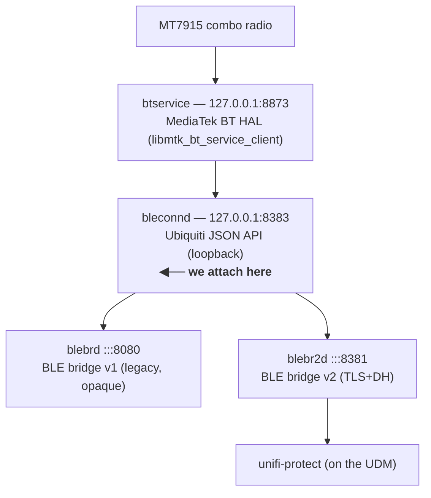
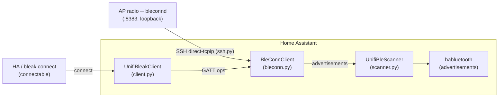

# Architecture

How the UniFi AP BLE proxy fits together, end to end.

## The idea

UniFi access points contain a BLE radio that UniFi's own daemons drive over a
local JSON API (`bleconnd`). This project attaches to that API as an extra client
and re-exposes the radio to Home Assistant as a **remote Bluetooth scanner** (and,
in progress, a **connectable** GATT proxy) — the same role an ESPHome Bluetooth
proxy plays. Each adopted AP becomes a coverage point; HA aggregates them and
picks the closest per device by RSSI.

## On-AP daemon stack

`bleconnd` is plaintext, unauthenticated, and multi-client by design (UniFi's own
bridges are already connected). We join as an additional client and never touch
`:8381`/`:8080`, so UniFi Protect is undisturbed. Because `:8383` is loopback-only,
we reach it over SSH.

## Data flow

- **Advertisements (passive, working):** `BleConnClient` runs a scan; each
  `scanResult` is parsed (`parse_advertisement`) and pushed into a
  `UnifiBleScanner` (a `habluetooth.BaseHaRemoteScanner`), which feeds HA's
  Bluetooth stack. Consuming integrations (Govee, BTHome, …) then match and create
  entities.
- **Connections (GATT, in progress):** when HA wants to connect to a device seen
  by a connectable scanner, `habluetooth` instantiates `UnifiBleakClient` (a bleak
  backend). It resolves the AP's `BleConnClient` from a registry (by advertisement
  `source` = AP MAC) and delegates connect/discover/read/write/notify to that
  client's GATT layer, which speaks `gattc*` to `bleconnd`.

## Components ([`custom_components/unifi_ble/`](../custom_components/unifi_ble/))

| File | Role |
|---|---|
| [`bleconn.py`](../custom_components/unifi_ble/bleconn.py) | Transport-agnostic async `bleconnd` client. Advertisement parser, scan loop with reconnect, and the GATT layer (connect/discover/read/write/notify) multiplexed over one session. Contains `Transport`/`TcpTransport`. No HA imports. |
| [`ssh.py`](../custom_components/unifi_ble/ssh.py) | `SshTunnelTransport` (asyncssh direct-tcpip to the AP's loopback, optional jump host) + shared Ed25519 keypair persisted in HA storage. Host keys pinned trust-on-first-use. HA-free at import. |
| [`scanner.py`](../custom_components/unifi_ble/scanner.py) | `UnifiBleScanner(BaseHaRemoteScanner)` — turns parsed advertisements into habluetooth advertisements. |
| [`client.py`](../custom_components/unifi_ble/client.py) | `UnifiBleakClient(BaseBleakClient)` — bleak backend routing GATT through a `BleConnClient`, plus the source→client registry. |
| [`__init__.py`](../custom_components/unifi_ble/__init__.py) | Config-entry setup: build the SSH transport, fail-fast probe, register one scanner per AP, run the client as a background task, clean unload. |
| [`config_flow.py`](../custom_components/unifi_ble/config_flow.py) | UI flow: show the public key to provision in UniFi, collect AP connection details, validate by tunneling + handshaking, pin host keys. |
| [`binary_sensor.py`](../custom_components/unifi_ble/binary_sensor.py), [`sensor.py`](../custom_components/unifi_ble/sensor.py) | Diagnostic entities (connectivity, active connections, devices in range) fed by a snapshot `DataUpdateCoordinator`. |
| [`const.py`](../custom_components/unifi_ble/const.py), [`manifest.json`](../custom_components/unifi_ble/manifest.json), [`strings.json`](../custom_components/unifi_ble/strings.json), [`translations/`](../custom_components/unifi_ble/translations/) | Constants, metadata, UI strings. |

## Transport abstraction

`BleConnClient` takes a `Transport` so the same client works in two contexts:
- `TcpTransport` — plain TCP to a pre-existing `ssh -L` forward, used by the CLI
  tools and by the sandbox for live testing.
- `SshTunnelTransport` — production; opens the SSH connection itself.

## Protocol references

- [`docs/unifi-ble-and-bleconnd.md`](unifi-ble-and-bleconnd.md) — the authoritative
  protocol reference: framing, session/handshake, scanning, the connection
  lifecycle, and the full GATT client (connOpen always `type:"public"`, events
  keyed by `name`, write value key is `data`, subscribe = write CCCD `0100`, notify
  event `gattsCharValueNotify`, error codes, etc.).
- [`tools/bleconn.py`](../tools/bleconn.py) — framing + scan, with a pcap decoder self-test.

## Tooling ([`tools/`](../tools/))

| Tool | Purpose |
|---|---|
| [`py`](../tools/py) | Run the venv Python with snap env vars stripped. |
| [`scan_ha.py`](../tools/scan_ha.py) | Exercise the async client + parser against forwarded ports. |
| [`bleconn.py`](../tools/bleconn.py) | pcap decoder + one-shot handshake probe. |
| [`gatt_probe.py`](../tools/gatt_probe.py) | Reverse the connection/GATT JSON live. |
| [`gatt_client_test.py`](../tools/gatt_client_test.py) | End-to-end test of `BleConnClient`'s GATT layer. |
| [`blectl.py`](../tools/blectl.py) | Interactive bluetoothctl/gatttool-style CLI (scan/connect/gatt) over an AP. |
| [`run_against_ap.py`](../tools/run_against_ap.py) | Run the real SSH transport against a live AP with a key. |
| [`run_ha.sh`](../tools/run_ha.sh) | Launch HA from the venv with the integration linked in. |
| [`validate_ha.py`](../tools/validate_ha.py) | Validate the habluetooth API surface inside real HA. |

## Status

- Passive scanning: implemented and running in HA.
- GATT: protocol fully reversed ([`docs/unifi-ble-and-bleconnd.md`](unifi-ble-and-bleconnd.md)); `BleConnClient` GATT
  layer (Phase B) verified live; `UnifiBleakClient` (Phase C) implemented; Phase D
  wired — the scanner registers `connectable=True` with a `HaBluetoothConnector`
  and `DEFAULT_MAX_CONNECTIONS` slots, and `register_client(source, client)` lets
  the backend resolve its AP. Pending: live verification of an actual GATT
  connection through Home Assistant.
