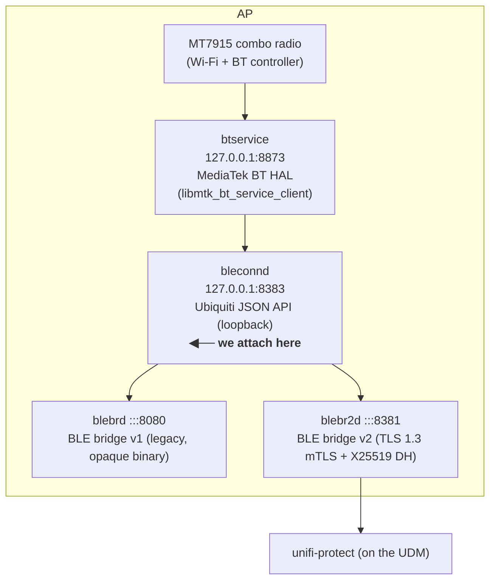
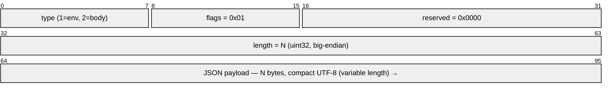
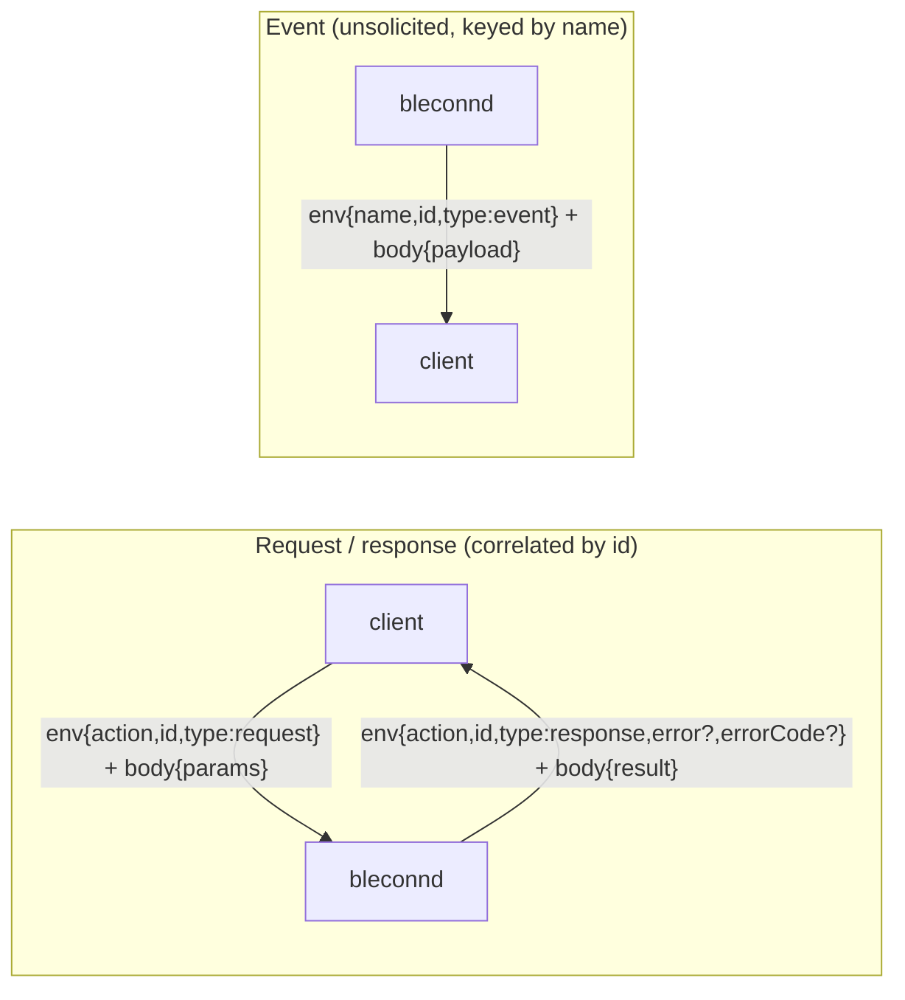
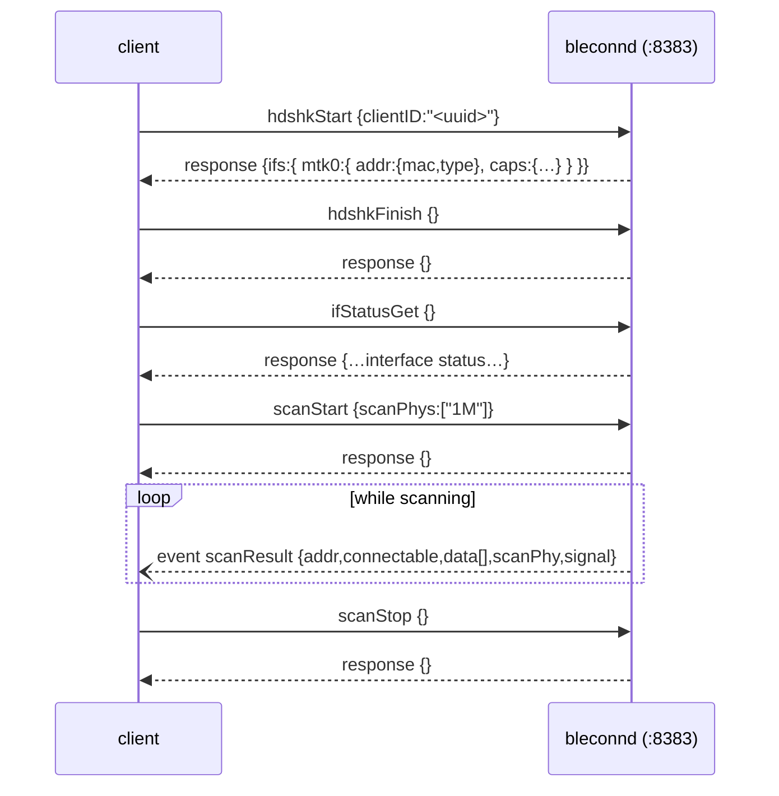
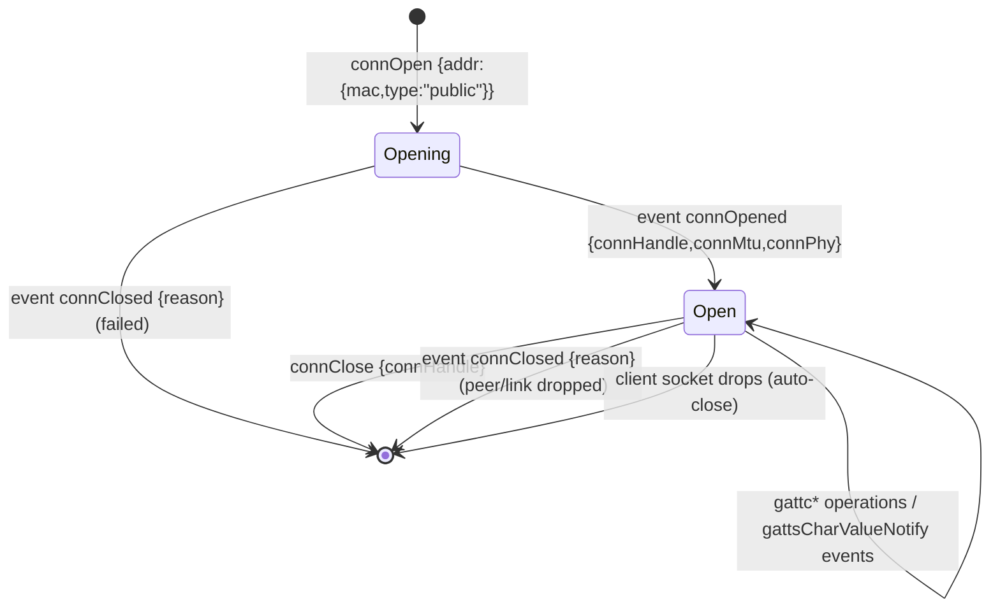
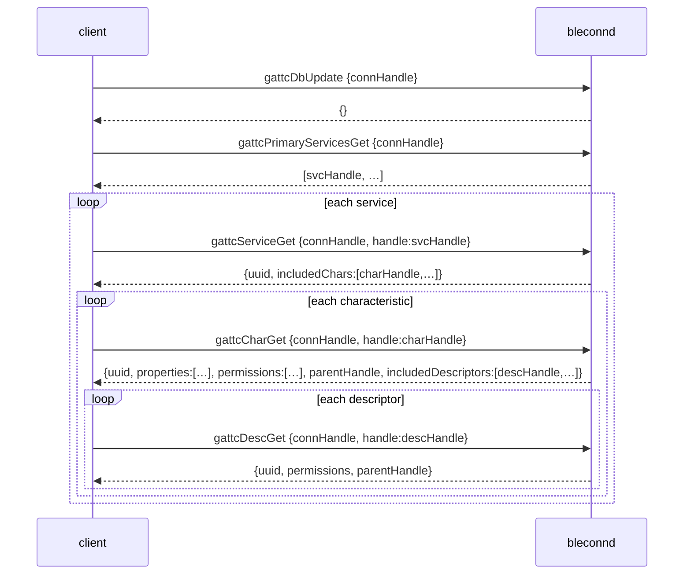
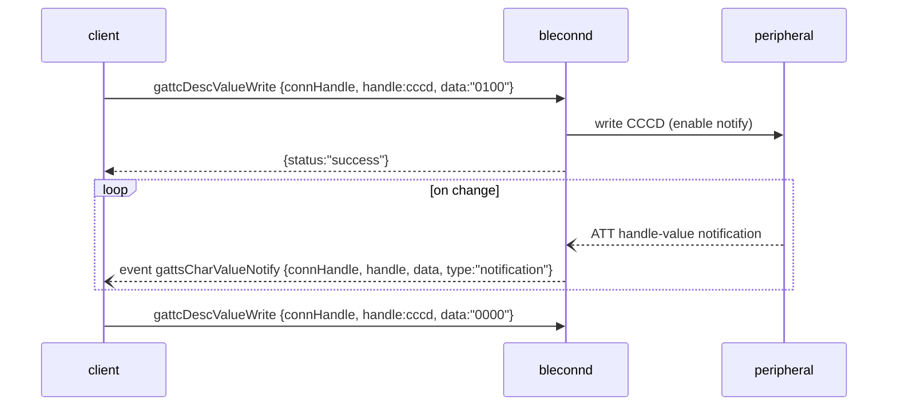
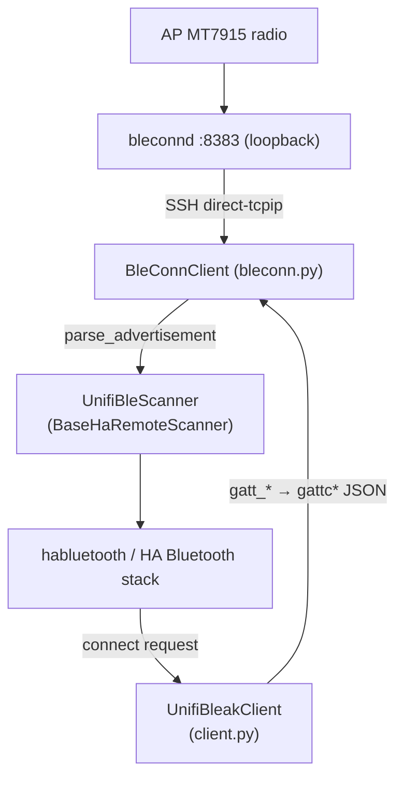

# UniFi AP Bluetooth LE & the `bleconnd` protocol

A complete, reverse-engineered description of **how UniFi access points implement
Bluetooth Low Energy** and of the **`bleconnd` JSON API** we attach to. This is the
authoritative protocol reference — framing, session, scanning, connections, and the
full GATT client. Everything here was confirmed live against production APs
(firmware daemons are aarch64/musl, no Python on device) and pcap captures; the
reference implementation is
[`custom_components/unifi_ble/bleconn.py`](../custom_components/unifi_ble/bleconn.py)
and [`tools/bleconn.py`](../tools/bleconn.py).

---

## Part 1 — How UniFi implements BLE on their APs

### 1.1 Hardware

UniFi-Protect-capable APs carry a **MediaTek MT7915 combo radio** that provides
Wi-Fi *and* a Bluetooth controller on the same die. The BLE side is what UniFi
uses for device onboarding *(the "Bluetooth" adoption you do from the mobile app)*
and for Protect's proximity feature and The Protect All-In-One Sensor.
There is exactly **one** BLE interface per AP (reported as `mtk0`),
with a single public adapter MAC.

### 1.2 The on-AP daemon stack

UniFi does **not** expose the controller directly. A layered stack of native
daemons sits between the radio and any consumer, each one loopback-bound:



- **`btservice` (`127.0.0.1:8873`)** — the MediaTek Bluetooth HAL client
  (`libmtk_bt_service_client`). It owns the vendor controller interface and is the
  lowest software layer above the silicon.
- **`bleconnd` (`127.0.0.1:8383`)** — Ubiquiti's own daemon. It exposes a
  **plaintext, unauthenticated, length-prefixed JSON API** over loopback TCP and
  is the real "BLE service": scanning, advertisement delivery, connection
  management and a full GATT-client API all live here. It is **multi-client by
  design** — UniFi's own bridges are connected simultaneously, and it happily
  accepts additional clients (confirmed: a 3rd client handshake is accepted and
  coexists with Protect).
- **`blebrd` (`:::8080`, "v1")** — a legacy network-facing bridge speaking an
  opaque, client-driven binary protocol (not HTTP/WS). Deprecated; not used by
  this project.
- **`blebr2d` (`:::8381`, "v2")** — the current network-facing bridge. It fronts
  a filtered subset of `bleconnd` (`scanStart`/`scanResult` + a Discovery filter)
  behind **two** auth layers (see §1.4). Its sole consumer today is
  **`UniFi Protect`** running on the UDM, which reaches each AP over `:8381`.

### 1.3 Why we attach at `bleconnd` (`:8383`)

`bleconnd` is the richest and least-guarded surface:

- **No crypto.** Plain length-prefixed JSON; no TLS, no app-layer auth.
- **Multi-client.** Attaching as an extra client does **not** disturb Protect —
  we never touch `:8381`/`:8080`, so Protect's bridge session is untouched.
- **Full capability.** Scanning *and* connectable GATT (the network bridges only
  expose a scan/discovery subset).

Because `:8383` is **loopback-only**, we reach it over an **SSH `direct-tcpip`
channel** to the AP's `127.0.0.1:8383` (the SSH transport is what the Home
Assistant integration ships; the CLI tools use a plain `ssh -L` forward instead).

### 1.4 Network-bridge auth model (for reference — not used here)

Assessed while deciding how to reach the radio without SSH:

| Port | Daemon | Transport | Auth | Verdict |
|------|--------|-----------|------|---------|
| 8080 | `blebrd` v1 | plain TCP, opaque binary | none observed | deprecated, protocol unknown — skip |
| 8381 | `blebr2d` v2 | **TLS 1.3 mutual-auth** | (1) mTLS **+** (2) `BleAuthProto` | see below |
| 8383 | `bleconnd` | plain TCP JSON (loopback) | **none** | **what we use (via SSH)** |

For `:8381`, the **mTLS layer is solved** — the on-disk `blebr.cert` / `blebr.key`
(a shared self-signed cert that is its own issuer) work as the *client* cert, and
the TLS 1.3 mutual handshake passes even while Protect is connected. The remaining
blocker is the **`BleAuthProto` application layer**: msgpack framing with an
X25519 Diffie–Hellman exchange (libsodium `crypto_kx`-style), gated by a **per-AP
pre-shared secret** set at adoption (stored in the AP's `/etc/persistent/blebr.tgz`
and/or the Protect config on the UDM). Failing it yields `"Bad secret"` /
`"Bad auth key"`. Reversing that + extracting the secret is deferred; the shipped
path is `:8383` + SSH.

---

## Part 2 — The `bleconnd` protocol

### 2.1 Wire framing

Every physical write to the socket is a **frame**: a fixed **8-byte header**
(`struct ">B B H I"`) followed by a big-endian-length-prefixed JSON payload.



| Bytes | Field | Value |
|-------|-------|-------|
| `0` | `type` | frame type — `1` = envelope, `2` = body |
| `1` | `flags` | always `0x01` |
| `2–3` | `reserved` | always `0x0000` |
| `4–7` | `length` | payload length `N` (uint32, big-endian) |
| `8 … 8+N` | `payload` | `N` bytes of compact UTF-8 JSON (`separators=(",",":")`, no whitespace) |

> The packet diagram shows one frame. The payload row is fixed at 32 bits only so
> it renders; on the wire it is **`length` bytes long and variable**.

A **logical message is two back-to-back frames** — an envelope frame (type 1)
immediately followed by a body frame (type 2):


| `type` | Name | Contents |
|--------|------|----------|
| `1` | **envelope** | `{action, id, timestamp, type, ...}` metadata |
| `2` | **body** | the action's params / result / event payload |

A robust reader **resyncs** on frame type: if it ever lands mid-stream it skips
frames until it sees an envelope (type 1), then expects the following body (type
2). An envelope that is not immediately followed by a body must not swallow the
next message's envelope.

### 2.2 Message model

The **envelope** carries the routing/metadata:

```jsonc
{
  "action":    "scanStart",          // request/response: the RPC name
  "id":        "<uuid>",             // correlation id (client-generated)
  "timestamp": 1720000000000,        // ms since epoch
  "type":      "request",            // "request" | "response" | "event"
  "name":      "scanResult",         // events only: the event kind
  "error":     "…",                  // responses only, on failure
  "errorCode": 5                     // responses only, on failure (int)
}
```

Three message types:

- **request** — client → daemon. 
  Body holds the params.
- **response** — daemon → client. 
  Correlated to the request by `id`. On failure the envelope carries `error` (human string) +
  `errorCode` (int); the
  body may be empty.
- **event** — daemon → client, **unsolicited**. 
  The event kind is in the envelope `name` field, **not** `action`. Route events on `env["name"]`.



### 2.3 Session startup / handshake



1. **`hdshkStart {clientID:"<uuid>"}`** → response body is the full **interface
   capabilities blob**, `{"ifs": { "<iface>": { "addr": {...}, "caps": {...} }}}`.
   The first (only) iface key is `mtk0`; `ifs.mtk0.addr.mac` is the AP's BLE
   adapter MAC — used as the HA scanner **source** id.
2. **`hdshkFinish {}`** → binds the interface. The handshake succeeds even when
   `blebrd`/`blebr2d` are already connected (multi-client).
3. **`ifStatusGet {}`** → interface status (optional, informational).
4. **`scanStart {scanPhys:[...]}`** → begins scanning; `scanResult` events follow.

Rejected handshakes come back with an `errorCode` in the envelope.

### 2.4 Scanning

- **`scanStart {scanPhys:["1M"]}`** — begins an **active** scan. `scanPhys` is a
  list of PHYs (`"1M"`, `"coded"`). There are **no other tuning knobs**:
  passive-only scanning is unsupported, and there is no interval/window control.
- **`scanStop {}`** — stops scanning.
- Also present: **`resvsGet`**, **`freeResvsGet`**, **`connsGet`** (see §2.7).

Scanning coexists with Protect as an additional client. A 30 s 1M scan against a
populated AP saw ~19 diverse devices with real RSSI (`-78…-101 dBm`), including
sensors, beacons and BT-Mesh.

#### `scanResult` event body

```jsonc
{
  "addr": {
    "mac": "aabbccddeeff",                     // hex, no colons
    "type": "public"
  },
  "connectable": true,
  "data": [                                    // ALREADY AD-parsed by the daemon
    { "type": 1,    "value": "06" },           // type = GAP AD type, value = hex
    { "type": 255,  "value": "4c00…" }
  ],
  "scanPhy":     "1M",
  "signal":      { "quality": 42, "strength": -78 }   // strength = real RSSI (dBm)
}
```

Key point: the `data` array is **pre-parsed advertising data** — each element is
one AD structure `{type, value}` where `type` is the GAP AD type and `value` is
the raw hex of that structure's payload. There is **no need to parse raw adv
bytes**. `signal.strength` is the true RSSI in dBm.

> **Note on `addr.type`:** `bleconnd` reports **every** scanned device as
> `type:"public"`, even RPA/random addresses. This matters for connecting (§2.6).

#### AD-type → advertisement-field mapping

How `parse_advertisement` turns `data[]` into bleak/habluetooth fields:

| AD `type` | Meaning | Mapped to |
|-----------|---------|-----------|
| `0x02` / `0x03` | Incomplete / complete 16-bit service class UUIDs | `service_uuids` (each `0000xxxx-0000-1000-8000-00805f9b34fb`) |
| `0x04` / `0x05` | Incomplete / complete 32-bit service class UUIDs | `service_uuids` |
| `0x06` / `0x07` | Incomplete / complete 128-bit service class UUIDs | `service_uuids` (16 bytes LE → hyphenated) |
| `0x08` / `0x09` | Shortened / complete local name | `local_name` (UTF-8) |
| `0x0A` | Tx power level | `tx_power` (signed int8) |
| `0x16` | Service data — 16-bit UUID | `service_data[uuid] = value[2:]` |
| `0x20` | Service data — 32-bit UUID | `service_data[uuid] = value[4:]` |
| `0x21` | Service data — 128-bit UUID | `service_data[uuid] = value[16:]` |
| `0xFF` | Manufacturer-specific data | `manufacturer_data[company_id] = value[2:]` |

(Company IDs and 16/32-bit UUIDs are little-endian on the wire.)

### 2.5 Connection lifecycle (GATT central)

`bleconnd` is a full GATT **central**. Connections are multiplexed over the same
session and identified by an integer **`connHandle`**.



- **`connOpen {addr:{mac:"<hex>", type:"public"}}`** → response
  `{connHandle:<int>, guaranteedTime:30, status:"opening"}`. **Always send
  `type:"public"`** — `random` is rejected with `errorCode 29` ("Unsupported
  address"), and the firmware connects to the raw address as-is (verified against
  a phone RPA).
- **event `connsChanged`** `{connections:{"<handle>":{piq:<int>}}, maxConnections:8}`.
- **event `connOpened`** `{addr:{…}, connDirection:"outgoing", connHandle, connMtu, connPhy:"1M"}`
  — the connection is now fully open; `connMtu` is the negotiated ATT MTU.
- **event `connClosed`** `{addr:{…}, connDirection:"outgoing", connHandle, reason:"<str>"}`
  — arrives on peer/link drop *and* after an explicit close.
- **event `connParams`** (seen once) `{connHandle, connParams:{intervalMin,intervalMax,latency,timeout}}`.
- **`connClose {connHandle}`** → closes a connection. Connections **also
  auto-close when the client's socket disconnects** — there are no orphaned links.

### 2.6 GATT client operations

All GATT requests take `connHandle`. Discovery must be primed **once** after
`connOpened` with `gattcDbUpdate`.



| Action | Request body | Response |
|--------|--------------|----------|
| `gattcDbUpdate` | `{connHandle}` | `{}` (triggers DB discovery; no distinct event) |
| `gattcPrimaryServicesGet` | `{connHandle}` | `[<svcHandle:int>, …]` |
| `gattcServiceGet` | `{connHandle, handle:<svcHandle>}` | `{uuid, includedChars:[<charHandle>,…]}` |
| `gattcCharGet` | `{connHandle, handle:<charHandle>}` | `{uuid, properties:[…], permissions:[…], parentHandle:<svcHandle>, includedDescriptors:[<descHandle>,…]}` |
| `gattcDescGet` | `{connHandle, handle:<descHandle>}` | `{uuid, permissions:[…], parentHandle:<charHandle>}` |
| `gattcCharValueRead` | `{connHandle, handle:<charHandle>}` | `{data:"<hex>", offset:0, status:"success"}` |
| `gattcDescValueRead` | `{connHandle, handle:<descHandle>}` | same shape |
| `gattcCharValueWrite` | `{connHandle, handle:<charHandle>, data:"<hex>", withResponse?}` | `{status:"success"}` |
| `gattcDescValueWrite` | `{connHandle, handle:<descHandle>, data:"<hex>"}` | `{status:"success"}` |
| `gattcCharValueNotifyConfirm` | (indication confirmation; not yet exercised) | — |

- **Discovery must be primed.** `gattcDbUpdate` must be issued once after
  `connOpened`; it returns `{}` with no distinct completion event. Only then does
  `gattcPrimaryServicesGet` return the populated handle list.
- **`properties`** is an array drawn from `read`, `write`, `writeNoResponse`,
  `notify`, `indicate`. `permissions` is a parallel array; `parentHandle` links a
  characteristic to its service and a descriptor to its characteristic.
- **Reads** of a characteristic that lacks the `read` property fail with
  `errorCode 21` ("GATT protocol error").
- **The write value key is `data` (hex), NOT `value`.** Sending `value` fails with
  `errorCode 22` ("Driver failure"). `offset` is optional and `withResponse` is
  accepted, but write-with-offset is unsupported per the interface caps.
- **UUIDs** come back either as 16-bit shorthand (`"2a37"`, `"1800"`) or full
  128-bit (`"0000aaa1-0000-1000-8000-aabbccddeeff"`). The **CCCD** is uuid `2902`.

### 2.7 Notifications & subscriptions

There is **no dedicated subscribe action**. Subscribing = **writing the CCCD**
(descriptor uuid `2902`) of the target characteristic:

| CCCD `data` | Effect |
|-------------|--------|
| `0100` | enable **notify** |
| `0200` | enable **indicate** |
| `0000` | disable |

Incoming data arrives as an **event**:

```jsonc
// env: { "name": "gattsCharValueNotify", "type": "event", ... }
{ "connHandle": 3, "handle": 45, "data": "1a2b3c", "type": "notification" | "indication" }
```

The client keys callbacks on `(connHandle, charHandle)`. Indications additionally
require `gattcCharValueNotifyConfirm` (present, not yet exercised).



### 2.8 Reservations & connection slots

`bleconnd` manages a **shared pool of 8 reservations** (advertiser + connection
slots) across *all* clients — including Protect.

- **`connsGet`** → `{connections:{…}, maxConnections:8}`.
- **`freeResvsGet`** → `{advertiser:7, connection:7}` (free counts, ≤ 8).
- **`resvsGet`** → reservation detail.

Because the pool is shared, active GATT connections are the main coexistence risk
with Protect (passive scanning is not). The HA integration derives its
`connection_slots` / `can_connect` from `freeResvsGet`.

### 2.9 Error codes

Errors are reported in the **response envelope** as `error` (string) + `errorCode`
(int). Observed:

| `errorCode` | Meaning | Typical trigger |
|-------------|---------|-----------------|
| `5` | Invalid payload | missing required field (the message names it) |
| `18` | Unknown connection handle | `connHandle` not open |
| `21` | GATT protocol error | e.g. read a non-readable characteristic |
| `22` | Driver failure | e.g. wrong value key (`value` instead of `data`) |
| `29` | Unsupported address | `connOpen` with `type:"random"` |
| `31` | Unknown handle | bad attribute handle |

### 2.10 Action vocabulary (summary)

Confirmed / present action names, by area:

- **Session:** `hdshkStart`, `hdshkFinish`, `ifStatusGet`
- **Scanning:** `scanStart`, `scanStop`
- **Reservations:** `resvsGet`, `freeResvsGet`, `connsGet`
- **Connections:** `connOpen`, `connClose` (+ events `connsChanged`, `connOpened`,
  `connClosed`, `connParams`)
- **GATT client:** `gattcDbUpdate`, `gattcPrimaryServicesGet`, `gattcServiceGet`,
  `gattcCharGet`, `gattcDescGet`, `gattcCharValueRead`, `gattcDescValueRead`,
  `gattcCharValueWrite`, `gattcDescValueWrite`, `gattcCharValueNotifyConfirm`
  (+ event `gattsCharValueNotify`)
- **Also referenced in the binary** (not exercised here): further `gattc*` /
  `gatts*` / `adv*` / `conn*` verbs — the daemon can also act as a GATT server and
  advertiser.

---

## Appendix — end-to-end picture

How the protocol above is consumed by the Home Assistant integration:



- **Passive path (working):** each `scanResult` → `parse_advertisement` →
  `UnifiBleScanner.push()` → HA advertisement. One scanner per AP, keyed by the
  adapter MAC from `hdshkStart`.
- **Connectable path (implemented):** HA picks the closest connectable AP, bleak
  instantiates `UnifiBleakClient`, which resolves the AP's `BleConnClient` by
  `source` (AP MAC) and delegates connect/discover/read/write/notify to the
  `gattc*` layer.

See also:
[`docs/architecture.md`](architecture.md) (component layout),
[`tools/bleconn.py`](../tools/bleconn.py) (pcap decoder + handshake probe),
[`tools/gatt_probe.py`](../tools/gatt_probe.py) (live GATT reversing).
